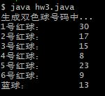

# HW1:计算一年中的第几天
## 思路：
1. 按照输出提示输入日期
1. 判断当前这一年是否为闰年，使用isLeapYear(当前年信息)判断，是返回true，不是返回false，闰年2月为29天
2. 将当前月份之前的所有月份相应的天数相加
3. 将当前日期加入天数总和
5. 输出答案

## 运行结果 :
 
# HW2：寻找1000以内的完美数个数
## 思路：
1. 从1到999循环，判断当前数是否为完美数:isPerfectNumber(int a) ,是返回true，不是返回false
2. 判断完美数时，从1开始循环到a-1，（此处可以优化到(a/2+1)）,判断a是否能整除当前数（%），如果是则加入一个初始值为0的变量sum。
3. 判断sum是否和a相等，是就返回true，不是返回false；

## 运行结果 :
 

# HW3：产生双色球
## 思路：
Java中，随机数可以调用java.util.random中的Random类，使用：
````java
Random r = new Random();
r.nextInt(upbound)
````
可以生成0~upbound之间的数。
由于双色球的数字是从1开始到33或16，因此将随机数上限分别设为32与16，产生随机数后加一即为[1,33]以及[1,16]区间的随机数

## 运行结果 :
 
# HW4:自动扩容数组
## 思路：
1. 输入数据，使用tmp记录当前数据所在的下标编号
````java
arr[tmp++]= scan.nextInt();
````
2. 判断当前下表是否超过原数组长度的 80%
````java
 if (tmp >= (arr.length * useRate)) 
````
3. 如果不是则继续输入，如果是则申请一个新数组，将arr中的数据全部复制到新数组中，再将新数组的地址给arr。
````java
 int[] changeArr = new int[(int) (arr.length * changeRate)];
    for (i = 0; i < arr.length; i++)
                    changeArr[i] = arr[i];
 arr=changeArr;
````
## 运行结果 :
 
# HW5：双重循环实现五子棋游戏棋盘的绘制
## 思路：
1. 将棋盘标号放入一个数组，方便打印时取用：
````java
final char[] index={'0','1','2','3','4','5','6','7','8','9','a','b','c','d','e','f'};
````
2. 打印棋盘上方的纵向标号：
````java
for(i=0;i<16;i++)    System.out.print(index[i]+" ");
}
````
3. 打印左侧横向标号与棋盘本体：
````java
 for(i=0;i<16;i++){
    System.out.print("\n"+index[i]+" ");
    for(j=0;j<16;j++)  System.out.print("+ ");
}
````
## 运行结果 :
 

